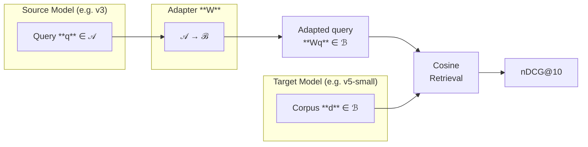
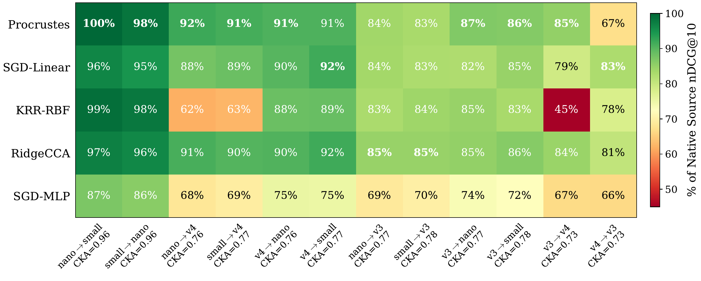

# Embedding Compatibility Adapters

[[Report](report.pdf)]

Your embedding provider deprecated their model. You have billions of documents embedded with the old one. Re-embedding costs thousands of dollars and days of compute.

A Procrustes adapter (one SVD, one matrix multiply) trained on 5000 calibration samples bridges embedding spaces with minimal quality loss - when the models are geometrically similar. No neural networks, no training loops, no GPUs.



## How it works

### Training

Two embedding models trained on similar data learn similar geometry. The spaces differ mainly by rotation. Procrustes alignment finds the optimal orthogonal matrix W from calibration pairs:

```
minimize  ||X_source @ W - X_target||_F   subject to  W^T W = I

Solution via SVD of M = X_source^T @ X_target:
    U, S, Vt = SVD(M)
    W = U @ Vt
```

Only d x d parameters, constrained to the orthogonal group. Impossible to overfit even with few calibration samples.

### Inference

`e_adapted = e_source @ W`. Orthogonality preserves norms and angles, so cosine similarities transfer directly. One matrix multiply per query.

## Quick start

```python
import numpy as np
from adapter import procrustes_align, apply_adapter

# Your calibration embeddings (same texts, both models)
# X_source: (n_cal, d_source) from old model
# X_target: (n_cal, d_target) from new model
W = procrustes_align(X_source, X_target)

# Transform old corpus embeddings to new space
corpus_adapted = apply_adapter(old_corpus_embs, W, target_dim=d_target)
```

Run the synthetic demo:

```bash
uv run adapter.py
```

## Results

Evaluated across 12 model pairs on NanoBEIR (13 retrieval tasks, nDCG@10). Procrustes beats CCA, KRR, SGD linear maps, and MLP adapters on 9 of 12 pairs. MLP is consistently worst: embedding alignment is a linear problem.



Native baselines:

| Model | nDCG@10 |
|---|---|
| jina-embeddings-v5-nano | 0.667 |
| jina-embeddings-v5-small | 0.671 |
| jina-embeddings-v3 | 0.634 |
| jina-embeddings-v4 | 0.647 |
| Qwen3-Embedding-0.6B | 0.584 |

Same-family adaptation (5000 calibration samples):

| Source -> Target | Adapted | Native Target | Retention |
|---|---|---|---|
| v5-nano -> v5-small | 0.666 | 0.671 | 99.3% |
| v5-small -> v5-nano | 0.660 | 0.667 | 98.9% |
| v3 -> v5-small | 0.548 | 0.671 | 81.7% |
| v4 -> v5-small | 0.586 | 0.671 | 87.3% |
| v3 -> v4 | 0.540 | 0.647 | 83.5% |
| v4 -> v3 | 0.434 | 0.634 | 68.5% |

Cross-vendor adaptation:

| Source -> Target | Adapted | Native Target | Retention |
|---|---|---|---|
| v5-nano -> Qwen3 | 0.613 | 0.584 | 105.0% |
| v5-small -> Qwen3 | 0.614 | 0.584 | 105.1% |
| v3 -> Qwen3 | 0.535 | 0.584 | 91.6% |
| v4 -> Qwen3 | 0.516 | 0.584 | 88.4% |
| Qwen3 -> v5-nano | 0.563 | 0.667 | 84.4% |
| Qwen3 -> v3 | 0.455 | 0.634 | 71.8% |

Models sharing architecture and training data (v5-nano/v5-small) have near-identical geometry - the adapter is lossless. Different generations or vendors have less overlap. CKA > 0.9 between model pairs predicts near-lossless adaptation; CKA < 0.8 means significant degradation.

## When to use this

Use Procrustes when your provider deprecated a model, you want to test a new model without re-embedding, or you need a bridge while planning full re-embedding. Re-embed instead when CKA similarity is below 0.8, architectures are fundamentally different, or dimension mismatch is extreme.

## References

- Schonemann (1966). A generalized solution of the orthogonal Procrustes problem. *Psychometrika* 31(1).
- Wang et al. (2025). UniCon: Universal Compatibility for Old-New Embedding Spaces. [arXiv:2604.16678](https://arxiv.org/abs/2604.16678)

## License

Apache 2.0
